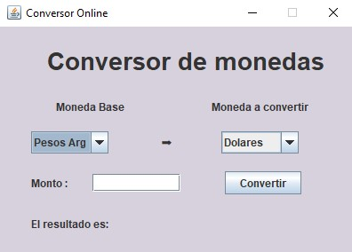

  

## Desafio Alura:
proyecto  de consulta a APIs externas con el fin de manipular respuestas del servidor convirtiendo monedas en tiempo real.

## JAR ejecutable
  - [DOWNLOAD](https://github.com/RaTon84/conversorMonedasAPI/blob/8e6da1baa32f24997eb355ebbd8935a9467854dc/ConversorMonedasAPI.jar)

  

  

### API consultada:
  - [API Conversor de monedas](https://www.exchangerate-api.com/)

### LIBRERIAS:
  - [GSON](https://mvnrepository.com/artifact/com.google.code.gson/gson)

### Administracion de proyecto
  - [TRELLO](https://trello.com/b/ikVZJ1cF)
